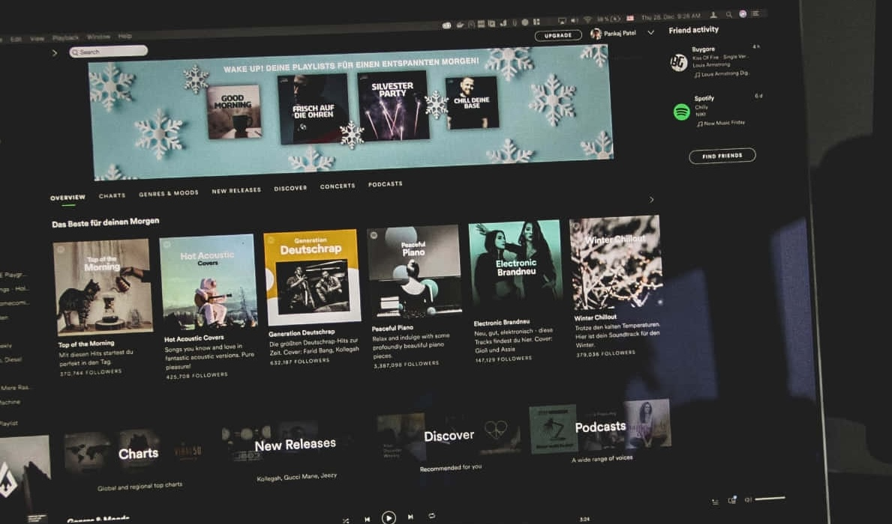
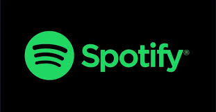

# Social Media Data Science Pipeline (CS 515-01)
 

## Project-3 Implementation

### Group 
> chestnut

### Work distribution
### Implementation and Design
- Disha Shetty (dshetty3@binghamton.edu)
- Shubham Patil (spatil36@binghamton.edu)

### Documentation
- Disha Shetty (dshetty3@binghamton.edu)
- Om Fale (ofale1@binghamton.edu)

### Introduction

In the ever-evolving landscape of the music industry, our project delves into the intricate dynamics that define an artist's journey in this era of unprecedented change. Leveraging a fusion of social media analysis and data science methodologies, we tap into the expansive realms of Reddit and Spotify. Through Reddit, a diverse online community, we unravel fan discussions, reviews, and opinions, discerning patterns in engagement and sentiment. Simultaneously, we harness Spotify's vast streaming data, offering insights into play counts, follower growth, and playlist placements. Join us on this exploration as we gather real-time music-related data, unveiling the pulse of emerging trends and popular artists within a specified timeframe.

## Intro to Flask

Flask is a micro web framework written in Python. It is classified as a microframework because it does not require particular tools or libraries. It has no database abstraction layer, form validation, or any other components where pre-existing third-party libraries provide common functions.

## Project Structure

    .
    ├── ...         
    ├── static
    │   ├── download.jpeg
    │   ├── research1.png
    │   ├── ...      
    ├── templates
    │   ├── dashboard.html    
    │   ├── ...
    ├── app.py
    └── credentials.env
    └── reddit.py
    └── spotify.py
    └── spotifyUtil.py
    └── FinalAnalysis.ipynb
    └── fclient.py
    └── fworker.py

## Description

* For this project, we have thought about and have answered three research questions/areas based on our datasets and the type of data
we have gathered. Our research objectives shall revolve around the factors influencing the popularity of artists based on data
collected from Reddit and Spotify. 
We already have collected relevant information from project 1 using posts of subreddits r/Spotify, r/Music, r/Popheads and official subreddits of artists data. As far for Spotify we have used playlist id () to get the daily top hits and the artists details to get to know the genre they follow to and their popularity.  Now it is time for us to play with these data.

* Further, we have answered the following research questions:

Ques. Is there a correlation between the level of activity on artist specific subreddits (e.g., official subreddits) and the artist’s success on Spotify, measured by metrics such as number of top hits and overall popularity?
* We have extracted data from artists_posts and artists_details and from artists_posts we have plotted the graph as to which artists get how many number of posts per day. Additionally, from Spotify API, we get the corresponding artists details and plot the graph and check the correlation coefficient for Artists: Popularity vs Number of Posts and study what will be the factors and whether does the spotify data goes hand in hand with the engaging number of posts related to the artists.
#If the coefficient is positive, it suggests a positive correlation (as the number of posts increases, popularity tends to increase).
#If the p-value is less than 0.05, you can reject the null hypothesis that there is no correlation.

Ques. How do the music genres discussed on Reddit correlate with the genres that users actually listen to on Spotify, and can we identify any trends in genre preferences from these discussions?
* By analyzing post frequency, we identified the top genres based on the occurrences of songs and their respective genres in Reddit posts. It's important to note that not all subreddits align perfectly, given the diverse user base discussing various genres like country, rock, and less mainstream songs. However, our analysis, reflected in the plotted graphs, reveals that pop and rap songs dominate discussions, garnering the highest number of comments. These genres seem to have a significant presence and engagement within the Reddit community according to our findings.

Ques. To what extent can the engagement metrics from Reddit (e.g., post popularity, comments, sentiment) and Spotify (e.g., daily top hits, artist details, popularity index) predict the commercial success and overall popularity of artists, and are there specific patterns or trends that indicate a higher likelihood of success within the music industry (sentiment analysis on the comments) ?
* Extensive analysis, encompassing data understanding, cleaning, and plotting, was conducted to address the research question. Utilizing sentiment analysis of comments and employing word clouds played a pivotal role in comprehending the patterns that underlie the phenomenon in question. Through thorough examination, it has become evident that established artists such as Taylor Swift, Travis Scott, The Weeknd, Drake, and SZA are poised to emerge as the top trending artists on Spotify by the end of the year, considering all the factors taken into consideration.

In addtion to that we have also developed a Web UI, to displat our results and fetching all the data and graphs we have plotted in the second implementation and answer the research questions.

### API Sources
  

## How to run the project?

Install `Python` and `MongoDB`
Python Lib required-> urllib, requests, json, pandas, pymongo, time, flask, pusher, matplotlib, plotly, os, collections, spotipy, tablet, PrettyTable etc

pip install pandas, numpy, pymongo, schedule, requests and such

In order to find the program files go to VM and in that access the dshetty3/project-3-implementation-chestnut folder. 
The data is fetched in real time for for all data source. We have used faktory job to run the project 1 files for data collection.
This helps us to achieve visualization of real time data.
In order to execute the code follow the below steps:
1. Go to dshetty3/project-3-implementation-chestnut folder
2. Run MongoDb from one terminal. Below are the commands:
    sudo systemctl start mongod
    sudo systemctl stop mongod
    mongod/ sudo mongod
3. Run spotify.py in a new terminal by using command python3 spotify.py. This willl give you the updated artists who have are trending for that particular day.   
4. Once MongoDB is up simulataneously to start scheduling open another terminal. Same directory as above. 
    Run the following commands
    source /home/dshetty3/project-1-implementation-chestnut/socialMediaProject1/bin/activate
    foreman start
    reddit.py will run and data will start to collect. You will now be able to see the data getting retrived in 5 sec interval in MongoDB Compass.
5. For Web API : Run the command
    python3 app.py
    Application will load on [http://127.0.0.1:5000/dashboard](http://127.0.0.1:5000/dashboard). 
6. Dashboard has sidbar which has a dashboard: 2 research questions along with Predictive Analysis

 

7. One and Two Analysis showing Variable Parameter - Artists list change on a daily basis.

#### References 

[1] Flask Library Documentation.
https://flask.palletsprojects.com/

[2] WordCloud Library Documentation.
https://pypi.org/project/wordcloud

[3] Seaborm Library Documentation. 
https://seaborn.pydata.org/

[4] Matplotlib Library Documentation
https://matplotlib.org/

[5] Textblob Library Documentation.
https://textblob.readthedocs.io/en/dev/

